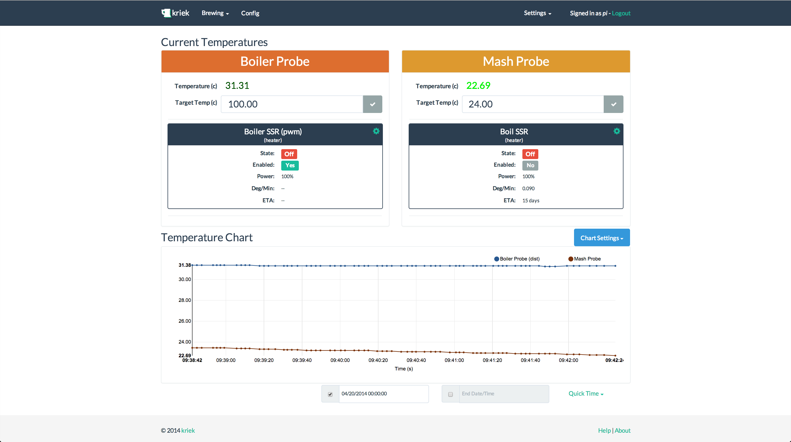

kriek
=====

Kriek is the easiest to use brewing control software for the raspberry pi.

Requirements
------------

A Raspberry Pi or BeagleBone Black.
DS18B20 temperature probes.
Solid State Relays.

Screen Shot
-----------

Installation
------------

### By hand installation ###

These instructions assume a debian-based (JESSIE) install (raspbian, ubuntu, etc) on the pi or BBB.

**Debian Setup**
* sudo apt-get update
* sudo apt-get upgrade -y
* sudo apt-get install libpq-dev python-dev postgresql postgresql-client nginx supervisor python-virtualenv -y

**For BBB**
* sudo apt-get install build-essential python-setuptools python-pip python-smbus -y

**Create a virutalenv for kriek**

* sudo mkdir /opt/kriek
* sudo chown pi /opt/kriek
* virtualenv /opt/kriek/env-kriek

**pip requirements**

* /opt/kriek/env-kriek/bin/pip install django==1.6.11 gunicorn psycopg2 django-suit djangorestframework==2.4.8 south celery django-celery

**We use either wiringpi or Adafruit_BBIO depending on the platform**

**for Pi**

* /opt/kriek/env-kriek/bin/pip install wiringpi

**for BBB**

* /opt/kriek/env-kriek/bin/pip install Adafruit_BBIO

**Configure postgres**
* sudo su - postgres
* createdb kriek
* psql -d kriek -c "CREATE user pi with password 'pi';"
* psql -d kriek -c "GRANT ALL PRIVILEGES ON DATABASE kriek to pi;";
* exit

**clone the source code**

* cd /opt/kriek/
* git clone https://github.com/jsproull/kriek.git

**Configure the django kriek installation**

* cd /opt/kriek/kriek
* ./manage.py syncdb
* #create a user named '**pi**' with password '**pi**'
* sudo ./manage.py collectstatic

**then set up gunicorn, supervisord and nginx**

* sudo rm /etc/nginx/sites-enabled/default
* sudo cp -R /opt/kriek/kriek/conf/ngnix/* /etc/nginx/
* sudo cp -R /opt/kriek/kriek/conf/supervisor/conf.d/* /etc/supervisor/conf.d/

**And set up the required modules**

**For Pi**

* sudo sh -c "echo 'w1_gpio\nw1_therm\n' >> /etc/modules"

### Automatic installation (Do not use for now) ###

~~* sh < <(curl -s "https://raw.githubusercontent.com/jsproull/kriek/master/shell/install.sh”)~~

### Common part for both methods ###

**For BBB**

**TODO**

**Reboot**

sudo reboot

Once rebooted, you should be able to go to http://yourip and sign in using username: **pi** with password: **pi**

**Configuration**
-------------

**Coming soon**

